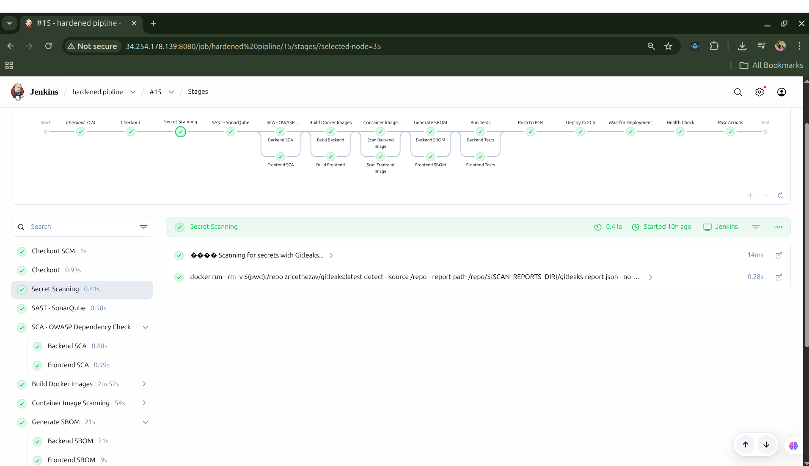
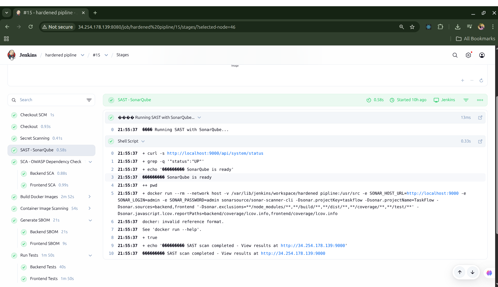
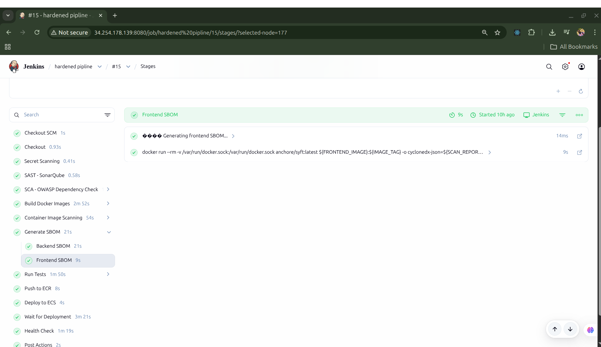
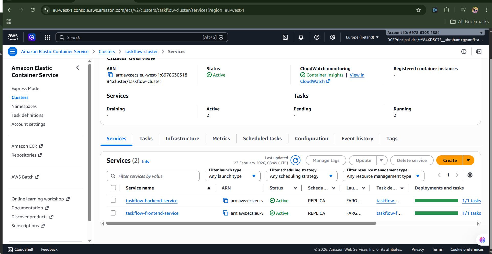
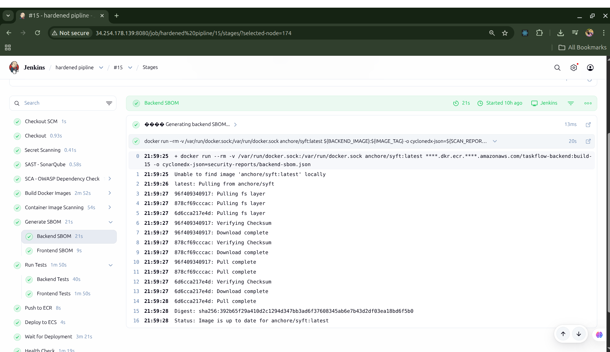
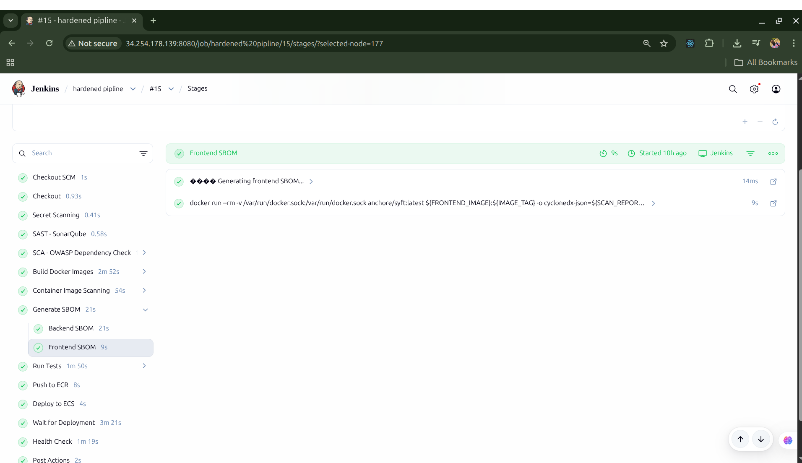
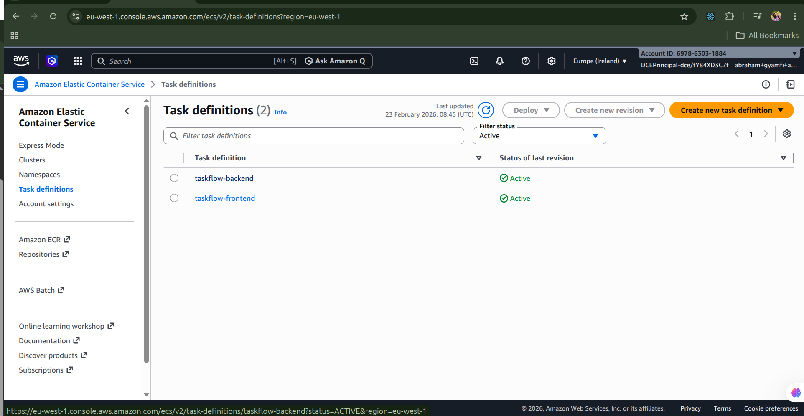
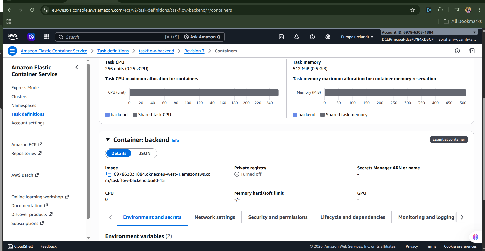
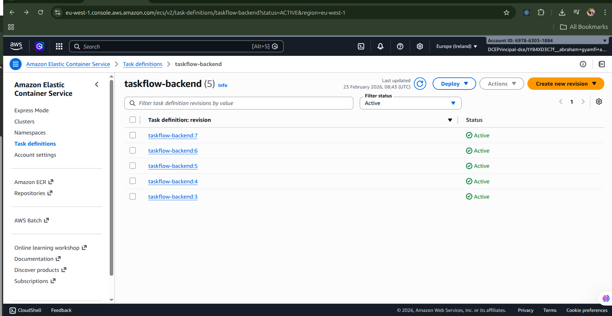

# TaskFlow: GitOps CI/CD Hardening Project

[](https://www.jenkins.io/)
[](https://www.docker.com/)
[](https://aws.amazon.com/)
[](https://www.terraform.io/)

TaskFlow is a full-stack task management application used to demonstrate a hardened CI/CD pipeline on AWS.

This repository combines:
- A React frontend and Node.js/Express backend.
- Security-first Jenkins pipeline design.
- Container build, scan, and SBOM workflows.
- AWS infrastructure provisioning with Terraform.

## Overview

The project focuses on delivery quality and security gates, not just app features.

Key objectives:
- Build and test both services in isolated Docker environments.
- Enforce multiple security controls before release.
- Publish versioned images to ECR.
- Deploy only from protected branches to ECS.
- Keep pipeline logic modular and maintainable.

## Core Features

Application features:
- Create, list, edit, complete, and delete tasks.
- Filter tasks by status (All, Active, Completed).
- Health endpoint for service monitoring (`/health`).

Platform/DevOps features:
- Parallelized build, test, and scan stages.
- Secret scanning (Gitleaks), SAST (SonarQube), SCA (OWASP Dependency-Check), image scanning (Trivy), SBOM generation (Syft).
- Branch-gated release (`main`/`master` only, no PR releases).
- ECS rollout, stability wait, ALB health verification, and task definition cleanup.

## Architecture

Application:
- Frontend: React 18 + Nginx container.
- Backend: Node.js + Express REST API.
- Data store: In-memory array (non-persistent by design).

Delivery:
- Jenkins pipeline orchestrates verification and release.
- Docker images are built/tagged as `build-<BUILD_NUMBER>` and `latest`.
- Images are pushed to AWS ECR.
- ECS services are updated with new task definition revisions.

Infrastructure (Terraform):
- Jenkins EC2 instance.
- Additional app EC2 instance.
- ECR repositories (backend/frontend).
- ECS services (backend/frontend).
- ALB + target groups.
- IAM roles and CloudWatch log groups.

## Repository Structure

```text
.
├── Jenkinsfile
├── backend/
├── frontend/
├── jenkins/
│   └── scripts/
├── terraform/
├── docker-compose.yml
├── docker-compose.prod.yml
├── provision-all.sh
└── test-vulnerable-dependency.sh
```

## Prerequisites

Local development:
- Node.js 18+
- npm

Container and pipeline workflows:
- Docker
- `jq` (used by scan and deploy scripts)
- AWS CLI (for release/deploy operations)

Infrastructure provisioning:
- Terraform >= 1.0

## Quick Start

### 1. Clone Repository

```bash
git clone git@github.com:AbrahamGyamfi/gitOps.git
cd gitOps
```

### 2. Run Locally (Node.js)

Backend:

```bash
cd backend
npm install
npm start
```

Frontend (new terminal):

```bash
cd frontend
npm install
npm start
```

Access:
- Frontend: `http://localhost:3000`
- Backend health: `http://localhost:5000/health`

### 3. Run with Docker Compose

```bash
docker compose up --build
```

Access:
- Frontend: `http://localhost`
- Backend health: `http://localhost:5000/health`

## Testing

Backend tests:

```bash
cd backend
npm test
```

Frontend tests:

```bash
cd frontend
npm test
```

Current test files:
- `backend/server.test.js`
- `frontend/src/App.test.js`

## API Endpoints

- `GET /health`
- `GET /api/tasks`
- `POST /api/tasks`
- `PATCH /api/tasks/:id`
- `PUT /api/tasks/:id`
- `DELETE /api/tasks/:id`

## CI/CD Pipeline

Pipeline definition:
- `Jenkinsfile`

Execution model:
- Thin Jenkins orchestration layer.
- Operational logic delegated to `jenkins/scripts/*.sh`.

Main stages:
1. Checkout
2. Secret Scan (Gitleaks)
3. Run Tests (backend/frontend in parallel)
4. SAST - SonarQube (with quality gate check)
5. SCA - OWASP Dependency-Check (parallel)
6. Build Docker Images (parallel)
7. Container Security Scanning - Trivy (parallel)
8. Generate SBOM - Syft (parallel)
9. Release to ECS (`main`/`master` only)

Post actions:
- Archive `security-reports/**`
- Remove local build-tagged images

## Security Controls

The pipeline is fail-closed for security gates:
- Secrets found: build fails.
- Sonar quality gate not `OK`: build fails.
- High/Critical dependency vulnerabilities: build fails.
- High/Critical container vulnerabilities: build fails.

Artifacts generated under `security-reports/`:
- Gitleaks report
- OWASP Dependency-Check reports
- Trivy scan reports
- CycloneDX SBOM files

## Screenshots

Security and quality:




Container and supply chain:






ECS deployment evidence:





## Jenkins Configuration

Required Jenkins credentials:
- `aws-credentials` (AWS credentials binding)
- `aws-region` (Secret text)
- `aws-account-id` (Secret text)
- `sonarqube-credentials` (Username/Password)

Pipeline job:
- Type: Pipeline from SCM
- Script path: `Jenkinsfile`

Agent requirements:
- Docker available to Jenkins user
- AWS CLI and `jq` installed

## Terraform Infrastructure

Terraform root:
- `terraform/`

Typical flow:

```bash
cd terraform
cp terraform.tfvars.example terraform.tfvars
terraform init
terraform plan
terraform apply
```

Helpful outputs:
- `jenkins_url`
- `alb_url`
- `ecr_backend_repository_url`
- `ecr_frontend_repository_url`
- `ecs_cluster_name`

Detailed notes:
- `terraform/README.md`

## Useful Scripts

- `provision-all.sh`: end-to-end infrastructure bootstrap helper.
- `test-vulnerable-dependency.sh`: injects and removes a known vulnerable dependency to validate SCA blocking behavior.

## Known Limitations

- Backend persistence is in-memory; data is lost on restart.
- Some helper scripts/docs may need environment-specific updates before production use.
- If you enforce `npm ci` in CI, commit lock files for deterministic installs.

## License

This repository is intended for learning and portfolio demonstration unless otherwise specified by the owner.
