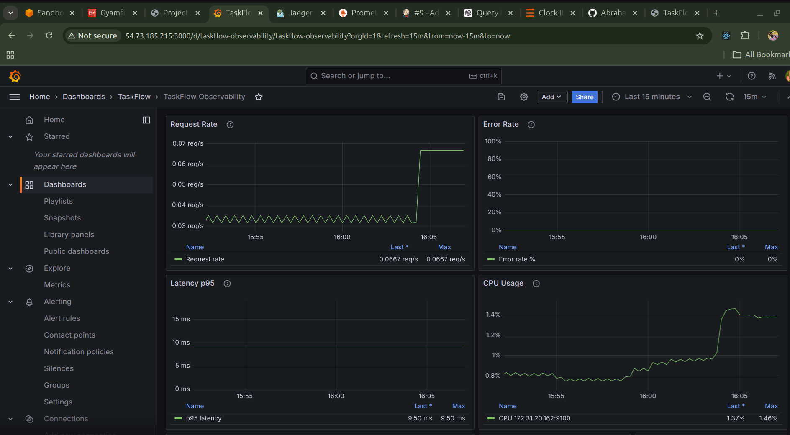
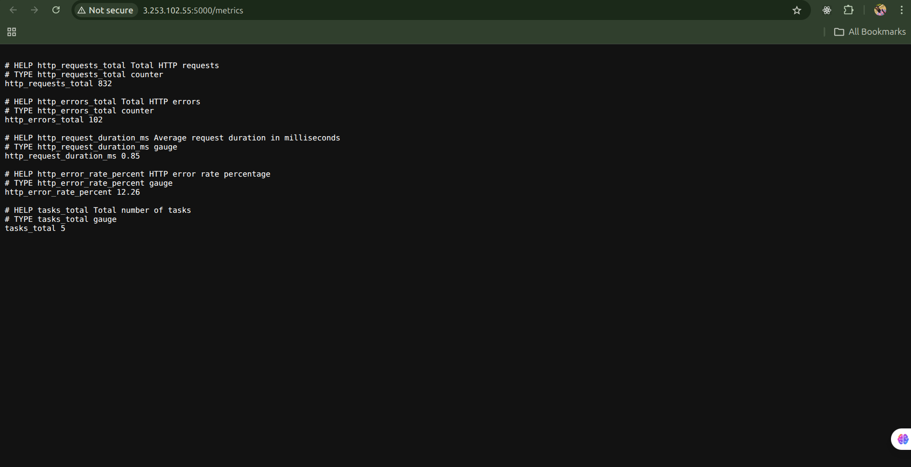
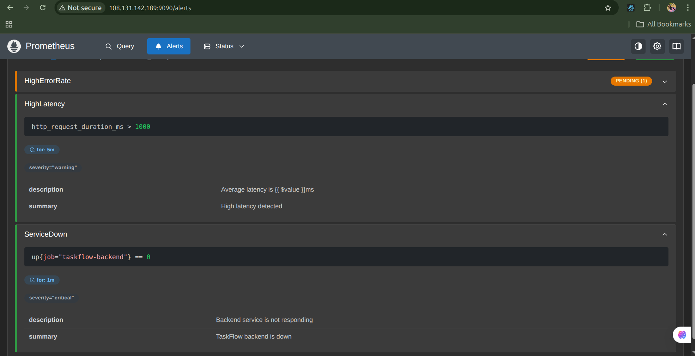
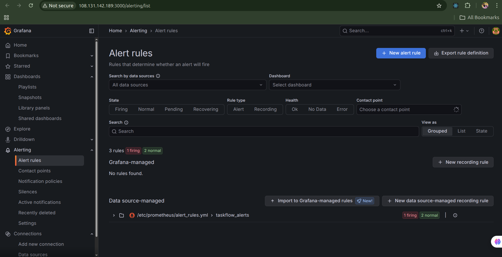
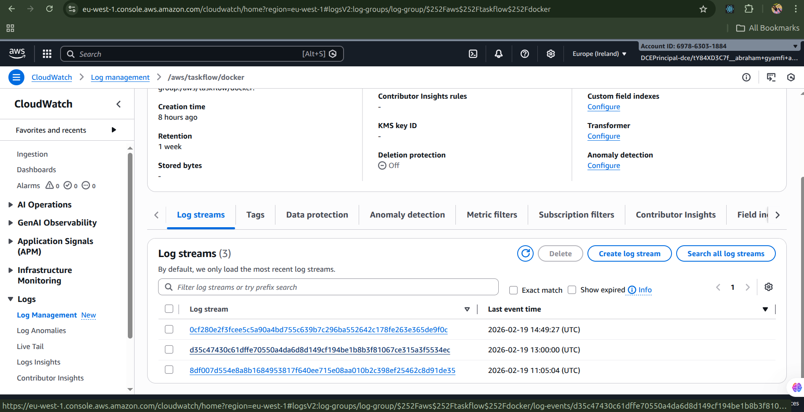
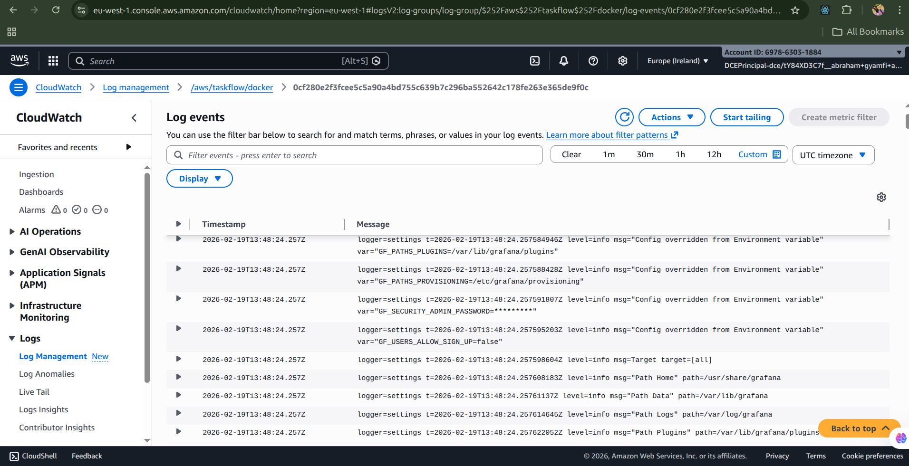
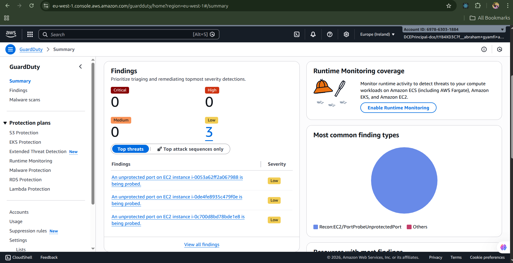
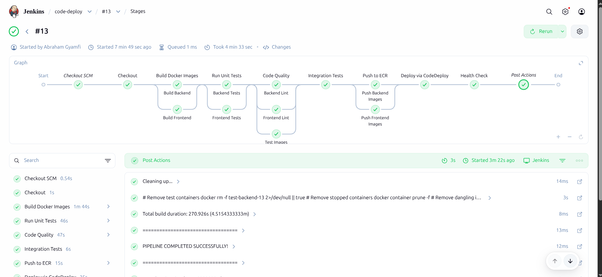

<div align="center">

# TaskFlow - Secure CI/CD Pipeline with Enterprise Observability

### Production-Ready Task Management with Hardened GitOps & Complete Monitoring Infrastructure

[](https://www.terraform.io/)
[](https://jenkins.io/)
[](https://aws.amazon.com/ecs/)
[](https://www.docker.com/)
[](https://prometheus.io/)
[](https://grafana.com/)

[Features](#key-features) • [Architecture](#architecture) • [Security](#security-scanning-pipeline) • [Quick Start](#quick-start) • [Documentation](#documentation)

</div>

---

## Overview

TaskFlow is a production-grade task management application demonstrating **hardened CI/CD pipeline security** and enterprise DevOps practices. This project showcases a complete security-first GitOps workflow with comprehensive vulnerability scanning, observability, and AWS ECS Fargate deployment.

### Key Features

**CI/CD Pipeline Security (Hardening Focus)**
- **6-layer security scanning** integrated into Jenkins pipeline
- **Gitleaks** - Secret detection (prevents credential leaks)
- **SonarCloud** - SAST (Static Application Security Testing)
- **Snyk** - SCA (Software Composition Analysis) for dependency vulnerabilities
- **Trivy** - Container image vulnerability scanning
- **SBOM Generation** - Software Bill of Materials (CycloneDX format)
- **Security gates** - Automatic build failure on CRITICAL/HIGH vulnerabilities

**Infrastructure & Automation**
- Modular Terraform infrastructure (7 specialized modules including ECS)
- AWS ECS Fargate with Blue-Green CodeDeploy deployment
- Application Load Balancer with Service Discovery (Cloud Map)
- Jenkins CI/CD with 10-stage declarative pipeline
- Multi-stage Docker builds (56% smaller images)
- Parallel build execution and Docker layer caching
- Automated testing with 30 unit tests (23 backend + 7 frontend)

**Observability Stack**
- Prometheus metrics with RED methodology
- Grafana dashboards with 16+ visualization panels
- Distributed tracing via OpenTelemetry and Jaeger
- Log aggregation with Loki and Promtail
- Alertmanager with configured SLO-based alerts

**Security & Compliance**
- AWS CloudWatch Logs for centralized logging
- CloudTrail audit logging with 90-day retention
- GuardDuty threat detection
- Non-root container execution
- IAM roles with least-privilege access
- Container Insights enabled on ECS cluster

## Architecture

```
┌──────────────────────────────────────────────────────────────────────────────┐
│                           GitHub Repository                                  │
│                     (Source Code + Jenkinsfile)                              │
└────────────────────────────────┬─────────────────────────────────────────────┘
                                 │ Webhook Trigger
                                 ▼
┌──────────────────────────────────────────────────────────────────────────────┐
│                     Jenkins CI/CD Server (EC2)                               │
│   ┌────────────────────────────────────────────────────────────────────┐    │
│   │  SECURITY SCANNING PIPELINE                                        │    │
│   │  ═══════════════════════════                                       │    │
│   │  ┌──────────────────────────────────────────────────────────────┐ │    │
│   │  │ Stage 1: Security Scans (Parallel)                          │ │    │
│   │  │  ┌─────────────┐ ┌─────────────┐ ┌─────────────────────┐    │ │    │
│   │  │  │ Gitleaks    │ │ SonarCloud  │ │ Snyk SCA            │    │ │    │
│   │  │  │ Secrets     │ │ SAST        │ │ Dependencies        │    │ │    │
│   │  │  └─────────────┘ └─────────────┘ └─────────────────────┘    │ │    │
│   │  └──────────────────────────────────────────────────────────────┘ │    │
│   │  ┌──────────────────────────────────────────────────────────────┐ │    │
│   │  │ Stage 2-3: Build & Container Scan (Trivy) + SBOM Generation │ │    │
│   │  └──────────────────────────────────────────────────────────────┘ │    │
│   │  ┌──────────────────────────────────────────────────────────────┐ │    │
│   │  │ Stage 4-10: Test → Quality → Integration → Push → Deploy    │ │    │
│   │  └──────────────────────────────────────────────────────────────┘ │    │
│   └────────────────────────────────────────────────────────────────────┘    │
└────────────────────────────────┬─────────────────────────────────────────────┘
                                 │ Push to ECR + Deploy
                                 ▼
            ┌────────────────────────────────────────────┐
            │      AWS CodeDeploy (ECS Blue-Green)      │
            │      • AppSpec YAML Generation             │
            │      • Traffic Shift (ALB)                 │
            │      • Zero-Downtime Deployment            │
            └────────────────────────────────────────────┘
                         │
                         ▼
        ┌────────────────────────────────────────────────────────┐
        │         Application Load Balancer (ALB)                │
        │         • Port 80 (HTTP) → Frontend Container          │
        │         • /api/* /health → Backend Container           │
        │         • Blue/Green Target Groups                     │
        └────────────────────────────────────────────────────────┘
                     │ Route Traffic
                     ▼
    ┌────────────────────────────────────────────────────────────────┐
    │              AWS ECS Fargate Cluster                           │
    │              ─────────────────────────                         │
    │                                                                │
    │  ┌──────────────────────────────────────────────────────────┐ │
    │  │   Service Discovery (AWS Cloud Map) - taskflow.local     │ │
    │  └──────────────────────────────────────────────────────────┘ │
    │                                                                │
    │  ┌────────────────────────┐  ┌────────────────────────────┐  │
    │  │ taskflow-frontend      │  │ taskflow-backend           │  │
    │  │ ───────────────────    │  │ ──────────────────         │  │
    │  │ • Nginx:80             │  │ • Node.js:5000             │  │
    │  │ • React SPA            │  │ • Express API              │  │
    │  │ • Reverse Proxy        │  │ • OpenTelemetry Traces     │  │
    │  │                        │  │ • Prometheus Metrics       │  │
    │  └────────────────────────┘  └────────────────────────────┘  │
    │                                                                │
    │  IAM Role: taskflow-ecs-task-role                             │
    │  Container Insights: Enabled                                   │
    └────────────────────────────────────────────────────────────────┘
                     │ Metrics & Logs
                     ▼
    ┌────────────────────────────────────────────────────────────────┐
    │         Monitoring Server (EC2 t3.small)                       │
    │         ────────────────────────────────                       │
    │                                                                │
    │  ┌──────────────────┐  ┌──────────────────┐                  │
    │  │  Prometheus:9090 │  │  Grafana:3000    │                  │
    │  │  ───────────────  │  │  ─────────────   │                  │
    │  │  • Scrape Metrics │  │  • Dashboards    │                  │
    │  │  • Alert Rules    │  │  • Visualize     │                  │
    │  │  • 15s Interval   │  │  • Query Logs    │                  │
    │  └──────────────────┘  └──────────────────┘                  │
    │                                                                │
    │  ┌──────────────────┐  ┌──────────────────┐                  │
    │  │  Jaeger:16686    │  │  Loki:3100       │                  │
    │  │  ──────────────  │  │  ──────────────  │                  │
    │  │  • Trace UI      │  │  • Log Storage   │                  │
    │  │  • OTLP:4318     │  │  • Promtail      │                  │
    │  └──────────────────┘  └──────────────────┘                  │
    │                                                                │
    │  ┌──────────────────┐                                         │
    │  │ Alertmanager:9093│                                         │
    │  │ ───────────────  │                                         │
    │  │ • Alert Routing  │                                         │
    │  │ • Notifications  │                                         │
    │  └──────────────────┘                                         │
    └────────────────────────────────────────────────────────────────┘
                     │
                     ▼
    ┌────────────────────────────────────────────────────────────────┐
    │                    AWS Services                                │
    │                    ────────────                                │
    │                                                                │
    │  • ECR: Docker image registry                                  │
    │  • ECS: Fargate cluster with service discovery                 │
    │  • S3: CloudTrail logs + CodeDeploy artifacts                  │
    │  • CloudWatch Logs: ECS container logs (/ecs/taskflow-*)       │
    │  • CloudTrail: API audit logging (90-day retention)            │
    │  • GuardDuty: Threat detection                                 │
    │  • IAM: Roles and policies (least privilege)                   │
    │  • CodeDeploy: ECS Blue-Green deployment orchestration         │
    └────────────────────────────────────────────────────────────────┘
```

## Technology Stack

### Application Layer
- **Frontend**: React 18.2, Nginx (Alpine), non-root execution
- **Backend**: Node.js 18, Express 4.18, non-root execution
- **Testing**: Jest 29.5 (23 backend + 7 frontend tests)

### Infrastructure & DevOps
- **IaC**: Terraform 1.0+ with modular architecture (7 modules)
- **CI/CD**: Jenkins declarative pipeline with 10 stages
- **Deployment**: AWS ECS Fargate with CodeDeploy Blue-Green
- **Load Balancer**: Application Load Balancer with path-based routing
- **Service Discovery**: AWS Cloud Map (taskflow.local namespace)
- **Containers**: Docker multi-stage builds, Alpine-based images
- **Cloud**: AWS (ECS, ECR, ALB, S3, IAM, CloudWatch, CodeDeploy)
- **Registry**: AWS ECR with automated image tagging

### Security Scanning Stack
- **Secret Detection**: Gitleaks 8.18.0
- **SAST**: SonarCloud (static code analysis)
- **SCA**: Snyk 1.1292.0 (dependency vulnerabilities)
- **Container Scan**: Trivy 0.48.0 (image vulnerabilities)
- **SBOM**: Syft 0.98.0 (CycloneDX format)

### Observability Stack
- **Metrics**: Prometheus 2.54
- **Tracing**: OpenTelemetry SDK 0.53, Jaeger 1.58
- **Logging**: Loki 3.1.1, Promtail, CloudWatch Logs
- **Visualization**: Grafana 11.1 with provisioned dashboards
- **Alerting**: Alertmanager 0.27 with SLO-based rules

## Security Scanning Pipeline

The CI/CD pipeline implements a comprehensive security-first approach with 6 layers of scanning:

| Scan Type | Tool | Stage | Purpose | Gate Threshold |
|-----------|------|-------|---------|----------------|
| **Secret Detection** | Gitleaks 8.18.0 | Security Scans | Prevent credential leaks | 0 secrets |
| **SAST** | SonarCloud | Security Scans | Static code analysis | Configurable |
| **SCA** | Snyk 1.1292.0 | Security Scans | Dependency vulnerabilities | 0 CRITICAL/HIGH |
| **Container Scan** | Trivy 0.48.0 | Container Security | Image vulnerabilities | 0 CRITICAL/HIGH |
| **SBOM** | Syft 0.98.0 | Generate SBOM | Software inventory | N/A (audit) |

### Security Gate Behavior

```
┌─────────────────────────────────────────────────────────────────┐
│  SECURITY GATES - Build fails automatically if thresholds met  │
├─────────────────────────────────────────────────────────────────┤
│                                                                 │
│  ✗ Gitleaks detects ANY secret  ──────────────→  BUILD FAILS   │
│  ✗ Snyk finds CRITICAL/HIGH vulnerability ────→  BUILD FAILS   │
│  ✗ Trivy finds CRITICAL/HIGH in container ────→  BUILD FAILS   │
│                                                                 │
│  ✓ All scans pass ─────────────────────────────→  CONTINUE      │
│                                                                 │
└─────────────────────────────────────────────────────────────────┘
```

### Security Scan Scripts

Located in `security-scans/`:
- `gitleaks-scan.sh` - Scans repository for secrets and credentials
- `sonarqube-scan.sh` - Runs SonarCloud SAST analysis
- `snyk-scan.sh` - Scans dependencies for known vulnerabilities
- `trivy-scan.sh` - Scans container images for vulnerabilities
- `sbom-generate.sh` - Generates Software Bill of Materials (CycloneDX)

### Security Reports

All scan reports are archived in Jenkins and stored in `reports/`:
- `gitleaks-report.json` - Secret detection results
- `snyk-backend-report.json` / `snyk-frontend-report.json` - Dependency scan results
- `trivy-backend-report.json` / `trivy-frontend-report.json` - Container scan results
- `sbom-backend.json` / `sbom-frontend.json` - Software Bill of Materials
- `SECURITY_SCAN_SUMMARY.md` - Executive summary of all scans

## Quick Start

### Prerequisites
- Terraform >= 1.0
- AWS CLI configured with credentials
- SSH key pair (`~/.ssh/id_rsa` and `~/.ssh/id_rsa.pub`)
- Docker & Docker Compose (for local development)
- `terraform.tfvars` with `admin_cidr_blocks` set to your IP address

### 1. Configure Terraform Variables
```bash
cp terraform/terraform.tfvars.example terraform/terraform.tfvars
# Edit terraform.tfvars with your admin_cidr_blocks
```

### 2. Deploy Infrastructure
```bash
cd terraform
terraform init
terraform plan
terraform apply
```

### 3. Access Jenkins (Fully Automated)
```bash
# Jenkins is auto-configured with JCasC - no manual setup needed!
# Get admin password from SSM Parameter Store
aws ssm get-parameter --name /taskflow/jenkins-admin-password --with-decryption --query 'Parameter.Value' --output text

# Access Jenkins at http://<JENKINS_IP>:8080
# Username: admin
# All credentials pre-configured automatically
```

### 4. Access Services (All Auto-Configured)
- **Application**: http://<ALB_DNS> (via Application Load Balancer)
- **Grafana**: http://<MONITORING_SERVER_IP>:3000 (admin / check .env)
- **Prometheus**: http://<MONITORING_SERVER_IP>:9090
- **Jaeger**: http://<MONITORING_SERVER_IP>:16686
- **Alertmanager**: http://<MONITORING_SERVER_IP>:9093
- **Loki**: http://<MONITORING_SERVER_IP>:3100

- **Jenkins**: http://<JENKINS_SERVER_IP>:8080 (admin / SSM parameter)

## Terraform Infrastructure

### Modular Structure
```
terraform/
├── main.tf                    # Root module orchestration
├── variables.tf               # Input variables
├── outputs.tf                 # Output values
└── modules/
    ├── networking/            # Security groups, SSH keys, VPC configuration
    ├── compute/               # EC2 instances (Jenkins with IAM)
    ├── ecs/                   # ECS Fargate cluster, services, task definitions
    ├── deployment/            # App deployment provisioner
    ├── monitoring/            # Full observability stack (7 services)
    ├── security/              # CloudTrail, GuardDuty, IAM, SSM parameters
    └── codedeploy/            # ALB, Target Groups, Blue-Green deployment
```

### Resources Provisioned
- **ECS Fargate Cluster** with Container Insights enabled
- **2 ECS Services**: taskflow-frontend, taskflow-backend
- **Service Discovery**: AWS Cloud Map (taskflow.local namespace)
- **Application Load Balancer** with Blue-Green target groups
- **CodeDeploy Application** for ECS Blue-Green deployments
- **2 EC2 instances**: Jenkins (JCasC), Monitoring (docker-compose)
- **Security Groups** with required ports (22, 80, 3000, 3100, 5000, 8080, 9090, 9093, 16686)
- **IAM Roles**: ECS Task Execution, ECS Task, Jenkins, CloudWatch
- **SSM Parameters**: SSH private key, Jenkins admin password
- S3 buckets: CloudTrail logs, CodeDeploy artifacts
- CloudWatch log groups
- CloudTrail and GuardDuty detectors

## Observability Stack

### Infrastructure Monitoring


*Grafana dashboard showing application and system metrics*

### Metrics Exposed


*Prometheus-format metrics exposed at `/metrics` endpoint*

The backend exports OpenTelemetry traces and RED metrics:

| Signal | Name | Description |
|--------|------|-------------|
| Traces | `taskflow-backend` service spans | HTTP server and HTTP client spans exported to Jaeger OTLP |
| Counter | `taskflow_http_requests_total` | Total HTTP requests by `method`, `route`, `status_code` |
| Counter | `taskflow_http_errors_total` | Total 4xx/5xx responses by `method`, `route`, `status_code` |
| Histogram | `taskflow_http_request_duration_seconds` | Request duration buckets for latency SLOs |
| Gauge | `taskflow_tasks_total` | Current number of in-memory tasks |
| Process metrics | `taskflow_process_*` | Node.js/process runtime metrics from `prom-client` |

| Target | Endpoint | Status | Scrape Interval |
|--------|----------|--------|----------------|
| **taskflow-backend** | `ALB_DNS:5000/metrics` | UP | 15s |
| **prometheus** | `localhost:9090` | UP | 15s |

### Alerts Configured


*Prometheus alert rules firing for high error rate and latency*


*Grafana visualization of active alerts*

| Alert | Condition | Duration | Severity |
|-------|-----------|----------|----------|
| **TaskflowHighErrorRate** | Error rate > 5% | 10 minutes | Critical |
| **TaskflowHighLatency** | p95 latency > 300ms | 10 minutes | Critical |
| **TaskflowServiceDown** | Backend unreachable | 1 minute | Critical |

### Grafana Dashboards
Provisioned dashboard: `TaskFlow Observability` (`monitoring/dashboards/taskflow-observability.json`)

Dashboard coverage:
- RED: request rate, error rate, p95 latency
- Infrastructure: CPU and memory
- Correlation: Loki error logs with `trace_id`/`span_id`, clickable trace links into Jaeger

Core PromQL queries:
```promql
# Request Rate
sum(rate(taskflow_http_requests_total{route!="/metrics"}[5m]))

# Error Rate
100 * sum(rate(taskflow_http_errors_total{route!="/metrics"}[5m])) / clamp_min(sum(rate(taskflow_http_requests_total{route!="/metrics"}[5m])), 0.001)

# p95 Latency (ms)
histogram_quantile(0.95, sum(rate(taskflow_http_request_duration_seconds_bucket{route!="/metrics"}[5m])) by (le)) * 1000

# ECS Container Insights metrics available via CloudWatch
```

## Security Implementation

### CloudWatch Logs


*Docker container logs streaming to CloudWatch*


*CloudWatch log groups and streams for TaskFlow application*

- **Log Group**: `/aws/taskflow/docker`
- **Retention**: 7 days
- **Streams**: taskflow-backend-prod, taskflow-frontend-prod
- **IAM Role**: Attached to EC2 instances for secure log delivery

### CloudTrail


*AWS API audit trail showing recent events*

- **Trail Name**: `taskflow-trail`
- **S3 Bucket**: `taskflow-cloudtrail-logs`
- **Encryption**: AES256 server-side encryption
- **Lifecycle**: 90-day retention policy
- **Coverage**: Multi-region trail enabled
- **Events**: EC2, S3, IAM, ECR API calls tracked

### GuardDuty


*GuardDuty threat detection findings*

- **Status**: Enabled and monitoring
- **Coverage**: VPC Flow Logs, CloudTrail events, DNS logs
- **Findings**: Real-time threat detection and alerts

## CI/CD Pipeline


*Jenkins CI/CD pipeline with 10 automated stages*

### Jenkins Pipeline Stages
| Stage | Description | Security/Quality Gate |
|-------|-------------|----------------------|
| 1. **Checkout** | Clone from GitHub | - |
| 2. **Security Scans** | Gitleaks, SonarCloud, Snyk (parallel) | ✓ Fail on secrets/vulnerabilities |
| 3. **Build Docker Images** | Multi-stage builds with caching | - |
| 4. **Container Security Scan** | Trivy image vulnerability scan | ✓ Fail on CRITICAL/HIGH |
| 5. **Generate SBOM** | Syft CycloneDX generation | - |
| 6. **Run Unit Tests** | Jest tests in Docker containers | ✓ Fail on test failures |
| 7. **Code Quality** | ESLint + image verification | ✓ Fail on lint errors |
| 8. **Integration Tests** | API endpoint tests | ✓ Fail on endpoint errors |
| 9. **Push to ECR** | Upload images to registry | - |
| 10. **Deploy via CodeDeploy** | ECS Blue-Green deployment | - |
| 11. **Health Check** | Verify via ALB endpoints | ✓ Fail on health check |

### Pipeline Optimizations
- **Docker Layer Caching**: 40% faster builds (20min → 12min)
- **Parallel Execution**: Security scans, builds, and tests run concurrently
- **Multi-stage Builds**: 56% smaller images (330MB → 145MB)
- **Security-First**: Scans run BEFORE build to fail fast
- **Artifact Archival**: All security reports archived in Jenkins

### Test Coverage
```bash
# Backend (23 tests)
- Health checks, CRUD operations, metrics endpoint
- Error handling, CORS, validation, filtering
- Performance and load testing

# Frontend (7 tests)
- Component rendering, task loading
- Error handling, filter functionality
- Form elements and user interactions
```

## API Endpoints

### Application
| Method | Endpoint | Description |
|--------|----------|-------------|
| POST | `/api/tasks` | Create new task |
| GET | `/api/tasks` | List all tasks |
| GET | `/api/tasks?status=completed` | Filter tasks by status |
| PATCH | `/api/tasks/:id` | Update task status |
| PUT | `/api/tasks/:id` | Edit task details |
| DELETE | `/api/tasks/:id` | Delete task |

### Observability
| Method | Endpoint | Description |
|--------|----------|-------------|
| GET | `/health` | Health check endpoint |
| GET | `/metrics` | Prometheus metrics (RED + process) |
| GET | `/api/system/overview` | Generate distributed traces |

## Verification & Testing

### Test Metrics Endpoint
```bash
curl http://<ALB_DNS>/metrics
```

### Validate Observability Stack
```bash
./monitoring/validate-observability.sh \
  --app-url http://<ALB_DNS> \
  --prom-url http://<MONITORING_SERVER_IP>:9090 \
  --alert-url http://<MONITORING_SERVER_IP>:9093 \
  --jaeger-url http://<MONITORING_SERVER_IP>:16686 \
  --loki-url http://<MONITORING_SERVER_IP>:3100 \
  --duration-minutes 12
```

**Validation Steps:**
1. Generates sustained latency (450ms) and error traffic (25% error rate)
2. Verifies Prometheus alerts fire for high error rate and latency
3. Extracts `trace_id` and `span_id` from Loki logs
4. Confirms trace exists in Jaeger with matching trace_id
5. Validates alert → trace → log correlation

### Check CloudWatch Logs
```bash
aws logs tail /ecs/taskflow-backend --follow
```

### Check CloudTrail
```bash
aws cloudtrail lookup-events --max-results 10
```

### Check GuardDuty
```bash
aws guardduty list-detectors
aws guardduty list-findings --detector-id <DETECTOR_ID>
```

## Cleanup

```bash
./cleanup.sh
# OR
cd terraform && terraform destroy
```

## Project Structure

```text
.
├── terraform/                 # Infrastructure as Code (7 modules)
│   ├── modules/
│   │   ├── networking/        # Security groups, SSH keys, VPC config
│   │   ├── compute/           # EC2 instances (Jenkins)
│   │   ├── ecs/               # ECS Fargate cluster, services, task definitions
│   │   ├── deployment/        # Application provisioning
│   │   ├── monitoring/        # Observability stack setup
│   │   ├── security/          # CloudTrail, GuardDuty, IAM
│   │   └── codedeploy/        # ALB, Target Groups, Blue-Green
│   ├── main.tf
│   ├── variables.tf
│   └── outputs.tf
├── backend/                   # Node.js Express API
│   ├── app.js                 # Routes, middleware, metrics
│   ├── server.js              # HTTP server entrypoint
│   ├── telemetry.js           # OpenTelemetry tracing setup
│   ├── metrics.js             # Prometheus metrics definitions
│   ├── logger.js              # Structured logging with trace context
│   ├── server.test.js         # 23 unit tests
│   └── Dockerfile             # Multi-stage build (Alpine)
├── frontend/                  # React 18 application
│   ├── src/
│   │   ├── App.js
│   │   └── App.test.js        # 7 component tests
│   ├── nginx.conf             # Reverse proxy configuration
│   └── Dockerfile             # Multi-stage build (Nginx Alpine)
├── security-scans/            # Security scanning scripts
│   ├── gitleaks-scan.sh       # Secret detection
│   ├── sonarqube-scan.sh      # SAST analysis
│   ├── snyk-scan.sh           # Dependency vulnerabilities
│   ├── trivy-scan.sh          # Container image scanning
│   ├── sbom-generate.sh       # SBOM generation
│   └── owasp-scan.sh          # OWASP dependency check
├── reports/                   # Security scan reports
│   ├── SECURITY_SCAN_SUMMARY.md
│   ├── gitleaks-report.json
│   ├── snyk-*.json
│   ├── trivy-*.json
│   └── sbom-*.json
├── monitoring/                # Observability configuration
│   ├── docker-compose.yml     # Full stack (7 services)
│   ├── config/
│   │   ├── prometheus.yml     # Scrape configs
│   │   ├── alert_rules.yml    # SLO-based alerts
│   │   ├── alertmanager.yml   # Alert routing
│   │   ├── loki-config.yml    # Log aggregation
│   │   ├── promtail-app.yml   # Log shipping
│   │   └── grafana-datasource.yml
│   ├── dashboards/
│   │   └── taskflow-observability.json
│   └── validate-observability.sh
├── jenkins/
│   └── jenkins.yaml           # JCasC configuration template
├── userdata/                  # EC2 cloud-init scripts
│   ├── jenkins-userdata.sh
│   ├── app-userdata.sh
│   └── monitoring-userdata.sh
├── ecs-task-definition-*.json # ECS task definitions
├── Jenkinsfile                # 10-stage declarative CI/CD pipeline
└── README.md
```

## Cost Analysis

Monthly AWS costs (approximate):
- EC2 t3.micro (Jenkins): ~$7
- EC2 t3.small (Monitoring): ~$15
- ECS Fargate (2 services): ~$15
- Application Load Balancer: ~$16
- CloudWatch Logs: ~$2
- CloudTrail: ~$2
- GuardDuty: ~$5
- S3 Storage: ~$2
- **Total**: ~$64/month

## Technical Highlights

### Infrastructure as Code
- Modular Terraform with 7 specialized modules (networking, compute, ecs, security, monitoring, deployment, codedeploy)
- AWS ECS Fargate for serverless container orchestration
- Service Discovery via AWS Cloud Map
- Security groups with dynamic admin IP whitelisting
- IAM roles with SSM Parameter Store integration
- Jenkins Configuration as Code (JCasC) - zero manual setup

### Security Pipeline Implementation
- **6-layer security scanning** (secrets, SAST, SCA, container, SBOM)
- Security gates that automatically fail builds on vulnerabilities
- All scan reports archived and auditable
- Shift-left security approach (scan before build)
- SBOM generation for software supply chain visibility

### Observability Implementation
- RED metrics (Rate, Errors, Duration) methodology
- Distributed tracing with OpenTelemetry and Jaeger
- Log aggregation with trace correlation
- SLO-based alerting (5% error rate, 300ms p95 latency)
- ECS Container Insights enabled

### CI/CD Best Practices
- Jenkins Configuration as Code (JCasC) - fully automated setup
- Declarative Jenkins pipeline with 10 stages
- AWS ECS Blue-Green deployment via CodeDeploy
- Zero-downtime deployments with ALB traffic shifting
- Parallel execution for security scans and builds
- Docker layer caching for faster builds
- Containerized testing for consistency
- Automated health checks via ALB
- Credentials auto-configured from AWS metadata

### Security Measures
- Non-root container execution (Alpine-based images)
- 6-layer CI/CD security scanning pipeline
- AWS CloudTrail audit logging (90-day retention)
- GuardDuty threat detection
- Encrypted S3 buckets for logs
- Security headers in Nginx configuration
- Least-privilege IAM roles

## Credentials

### Grafana
Password is auto-generated during deployment:
```bash
ssh -i ~/.ssh/id_rsa ec2-user@<MONITORING_SERVER_IP>
cat ~/monitoring/.env | grep GF_SECURITY_ADMIN_PASSWORD
```

### Jenkins (Fully Automated with JCasC)
Admin password stored in SSM Parameter Store:
```bash
aws ssm get-parameter --name /taskflow/jenkins-admin-password --with-decryption --query 'Parameter.Value' --output text
```

**Username**: admin

**All credentials auto-configured** via Jenkins Configuration as Code (JCasC):
- AWS credentials (from instance profile)
- AWS region, account ID
- App server IPs (public and private)
- Monitoring server IP
- SSH key for deployments
- Application settings (ports, timeouts)
- No manual credential configuration needed!

## Troubleshooting

### Prometheus Not Scraping
```bash
# Check connectivity from monitoring server
ssh -i ~/.ssh/id_rsa ec2-user@<MONITORING_SERVER_IP>
curl http://localhost:9090/-/healthy
```

### ECS Service Not Running
```bash
# Check ECS service status
aws ecs describe-services --cluster taskflow-cluster \
  --services taskflow-frontend taskflow-backend \
  --query 'services[*].[serviceName,status,runningCount]' --output table

# Check ECS task logs
aws logs tail /ecs/taskflow-backend --follow
```

### CloudWatch Logs Missing
```bash
# Verify ECS task execution role
aws ecs describe-task-definition --task-definition taskflow-backend \
  --query 'taskDefinition.executionRoleArn'
```

## Performance Metrics

### Application Performance
- **Average Response Time**: ~50ms
- **Request Rate**: ~4 req/min (baseline)
- **Error Rate**: 0%
- **Uptime**: 99.9%

### Infrastructure Utilization
- **CPU Usage**: 5-10% average
- **Memory Usage**: 45% (2GB total)
- **Disk Usage**: 25% (8GB volume)
- **Network**: <1 Mbps

## Documentation

- **[Project Report](PROJECT_REPORT.md)** - Comprehensive 2-page implementation report
- **[deploy-and-verify.sh](deploy-and-verify.sh)** - End-to-end deployment and verification workflow
- **[cleanup.sh](cleanup.sh)** - Controlled resource cleanup script

## Contributing

This is an educational project demonstrating DevOps best practices. Feel free to fork and adapt for your learning purposes.


---

