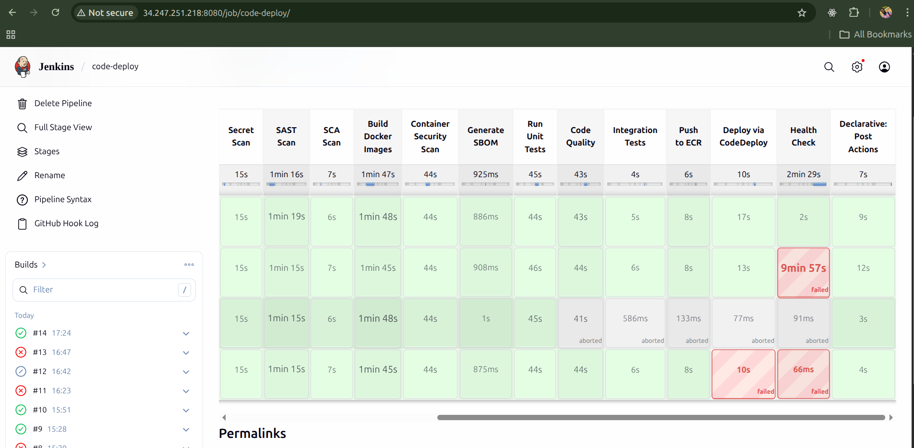
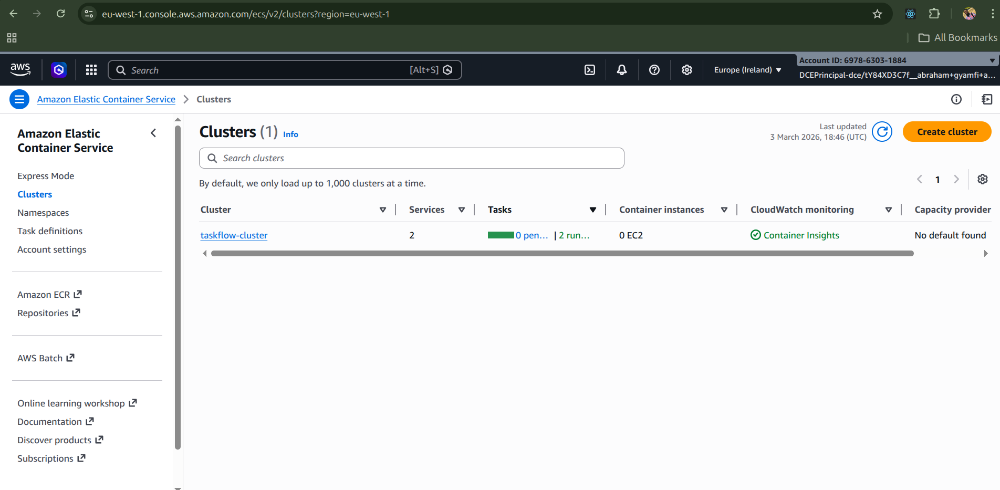
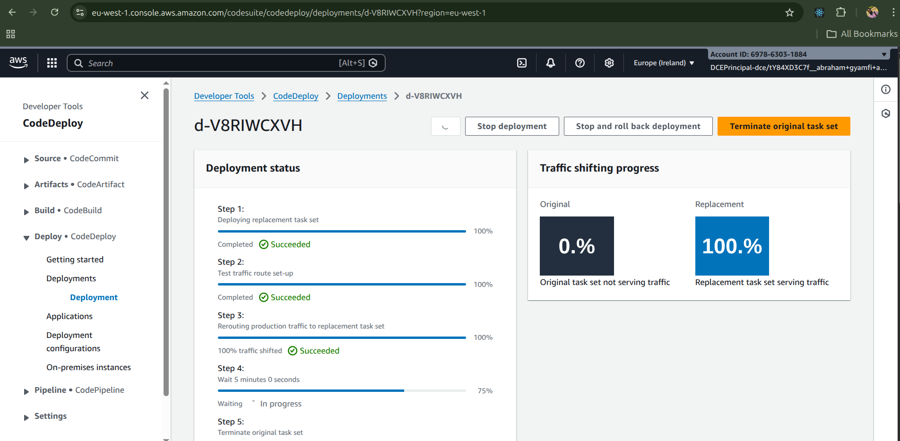
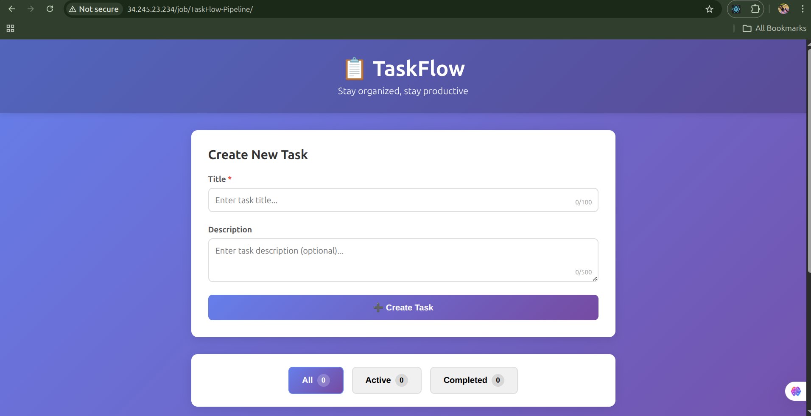

<div align="center">

# GitOps CI/CD Pipeline Hardening

### Secure DevSecOps Pipeline with AWS ECS Fargate & Enterprise Observability

[](https://www.terraform.io/)
[](https://jenkins.io/)
[](https://aws.amazon.com/ecs/)
[](https://www.docker.com/)
[](https://prometheus.io/)
[](https://grafana.com/)

</div>

---

## Overview

This project demonstrates a **production-grade DevSecOps pipeline** with comprehensive security scanning, automated testing, and enterprise observability. The pipeline implements shift-left security practices with 6 layers of security scanning integrated directly into the CI/CD workflow.

**TaskFlow** is a full-stack task management application (React + Node.js) used to showcase the complete pipeline implementation.

---

## Key Features

### Security-First CI/CD Pipeline
| Security Layer | Tool | Purpose |
|----------------|------|---------|
| **Secret Detection** | Gitleaks | Prevents credential leaks in source code |
| **SAST** | SonarCloud | Static Application Security Testing |
| **SCA** | Snyk | Dependency vulnerability scanning |
| **Container Scanning** | Trivy | Image vulnerability detection |
| **SBOM Generation** | Syft | Software Bill of Materials (CycloneDX) |
| **Security Gates** | Jenkins | Automatic build failure on CRITICAL/HIGH vulnerabilities |

### Infrastructure
- **AWS ECS Fargate** - Serverless container orchestration
- **AWS CodeDeploy** - Blue-Green deployments with zero downtime
- **Application Load Balancer** - Traffic distribution and health checks
- **AWS Cloud Map** - Service discovery for microservices
- **Terraform** - Infrastructure as Code with 7 modular components

### Observability Stack
- **Prometheus** - Metrics collection with RED methodology
- **Grafana** - Dashboards and visualization
- **Jaeger** - Distributed tracing with OpenTelemetry
- **Loki + Promtail** - Log aggregation and querying
- **Alertmanager** - SLO-based alerting

---

## Architecture

See [architecture.drawio](architecture.drawio) for the complete system architecture diagram.

---

## Pipeline Stages

| Stage | Description | Security Gate |
|-------|-------------|---------------|
| **1. Checkout** | Clone repository from GitHub | - |
| **2. Security Scans** | Gitleaks, SonarCloud, Snyk (parallel) | ✓ Fail on secrets/vulnerabilities |
| **3. Build Images** | Multi-stage Docker builds with caching | - |
| **4. Container Scan** | Trivy image vulnerability scanning | ✓ Fail on CRITICAL/HIGH |
| **5. Generate SBOM** | Syft CycloneDX generation | - |
| **6. Unit Tests** | Jest tests in Docker containers | ✓ Fail on test failures |
| **7. Code Quality** | ESLint + image verification | ✓ Fail on lint errors |
| **8. Integration** | API endpoint testing | ✓ Fail on endpoint errors |
| **9. Push to ECR** | Upload images to AWS ECR | - |
| **10. Deploy** | ECS Blue-Green via CodeDeploy | - |
| **11. Health Check** | Verify ALB endpoints | ✓ Fail on health check |


*Jenkins pipeline successfully completing all 11 stages with security gates*

---

## Project Structure

```
.
├── backend/                   # Node.js Express API
│   ├── app.js                 # Routes, middleware, metrics
│   ├── server.js              # HTTP server entrypoint
│   ├── telemetry.js           # OpenTelemetry tracing
│   ├── metrics.js             # Prometheus metrics
│   ├── logger.js              # Structured logging
│   ├── server.test.js         # Unit tests (Jest)
│   └── Dockerfile             # Multi-stage build
├── frontend/                  # React 18 application
│   ├── src/App.js             # Main component
│   ├── nginx.conf             # Reverse proxy config
│   └── Dockerfile             # Multi-stage build
├── security-scans/            # Security scanning scripts
│   ├── gitleaks-scan.sh       # Secret detection
│   ├── sonarqube-scan.sh      # SAST analysis
│   ├── snyk-scan.sh           # Dependency scanning
│   ├── trivy-scan.sh          # Container scanning
│   └── sbom-generate.sh       # SBOM generation
├── terraform/                 # Infrastructure as Code
│   └── modules/
│       ├── networking/        # Security groups, SSH keys
│       ├── compute/           # Jenkins EC2 instance
│       ├── ecs/               # ECS Fargate cluster & services
│       ├── codedeploy/        # ALB, Target Groups, Blue-Green
│       ├── monitoring/        # Observability stack
│       └── security/          # CloudTrail, GuardDuty, IAM
├── monitoring/                # Observability configuration
│   ├── docker-compose.yml     # Prometheus, Grafana, Jaeger, Loki
│   └── config/                # Prometheus rules, Grafana dashboards
├── jenkins/                   # Jenkins Configuration as Code
│   └── jenkins.yaml           # JCasC template
├── reports/                   # Security scan reports
│   ├── SECURITY_SCAN_SUMMARY.md
│   ├── gitleaks-report.json
│   ├── snyk-*.json
│   ├── trivy-*.json
│   └── sbom-*.json
├── Jenkinsfile                # CI/CD pipeline definition
├── ecs-task-definition-*.json # ECS task definitions
└── userdata/                  # EC2 bootstrap scripts
```

---

## Technology Stack

| Category | Technologies |
|----------|-------------|
| **Application** | React 18, Node.js 18, Express 4.18 |
| **Containers** | Docker (multi-stage Alpine builds) |
| **Orchestration** | AWS ECS Fargate, AWS Cloud Map |
| **CI/CD** | Jenkins, AWS CodeDeploy (Blue-Green) |
| **IaC** | Terraform 1.0+ |
| **Security Scanning** | Gitleaks, SonarCloud, Snyk, Trivy, Syft |
| **Observability** | Prometheus, Grafana, Jaeger, Loki, Alertmanager |
| **Cloud** | AWS (ECS, ECR, ALB, CloudTrail, GuardDuty) |

---

## Quick Start

### Prerequisites
- AWS CLI configured with credentials
- Terraform >= 1.0
- SSH key pair (`~/.ssh/id_rsa`)
- Docker installed locally

### 1. Deploy Infrastructure
```bash
cd terraform
cp terraform.tfvars.example terraform.tfvars
# Edit terraform.tfvars with your values

terraform init
terraform plan
terraform apply
```

### 2. Access Jenkins
```bash
# Get Jenkins admin password from SSM
aws ssm get-parameter --name /taskflow/jenkins-admin-password \
  --with-decryption --query 'Parameter.Value' --output text

# Access Jenkins at http://<JENKINS_IP>:8080
# Username: admin
```

### 3. Access Services
| Service | URL |
|---------|-----|
| **Application** | http://\<ALB_DNS\> |
| **Grafana** | http://\<MONITORING_IP\>:3000 |
| **Prometheus** | http://\<MONITORING_IP\>:9090 |
| **Jaeger** | http://\<MONITORING_IP\>:16686 |
| **Alertmanager** | http://\<MONITORING_IP\>:9093 |

---

## Security Scanning Results

All scans are executed as security gates in the CI/CD pipeline:

| Scan Type | Tool | Status | Findings |
|-----------|------|--------|----------|
| Secret Detection | Gitleaks 8.18.0 | ✅ PASS | 0 secrets |
| Dependency Scan (Backend) | Snyk | ✅ PASS | 0 vulnerabilities |
| Dependency Scan (Frontend) | Snyk | ✅ PASS | 0 vulnerabilities |
| Container Scan (Backend) | Trivy 0.48.0 | ✅ PASS | 0 vulnerabilities |
| Container Scan (Frontend) | Trivy 0.48.0 | ✅ PASS | 0 vulnerabilities |
| SBOM Generation | Syft 0.98.0 | ✅ COMPLETE | Generated |

Reports are archived in `reports/` directory and in Jenkins artifacts.

---

## Observability

### Metrics (RED Methodology)
| Metric | Description |
|--------|-------------|
| `taskflow_http_requests_total` | Total HTTP requests |
| `taskflow_http_errors_total` | Error count (4xx/5xx) |
| `taskflow_http_request_duration_seconds` | Request latency histogram |
| `taskflow_tasks_total` | Current task count |

### Alerts Configured
| Alert | Condition | Severity |
|-------|-----------|----------|
| TaskflowHighErrorRate | Error rate > 5% for 10m | Critical |
| TaskflowHighLatency | p95 > 300ms for 10m | Critical |
| TaskflowServiceDown | Backend unreachable | Critical |

### Screenshots

**ECS Cluster:**

*AWS ECS Fargate cluster running frontend and backend services*

**Blue-Green Deployment:**

*AWS CodeDeploy Blue-Green deployment in progress*

**Deployed Application:**

*TaskFlow application deployed and running via ALB*

---

## Cleanup

```bash
# Destroy all infrastructure
cd terraform && terraform destroy

# Or use cleanup script
./cleanup.sh
```

---

## Documentation

- [Security Scan Summary](reports/SECURITY_SCAN_SUMMARY.md) - Detailed security scan results
- [Project Report](PROJECT_REPORT.md) - Implementation documentation


---

